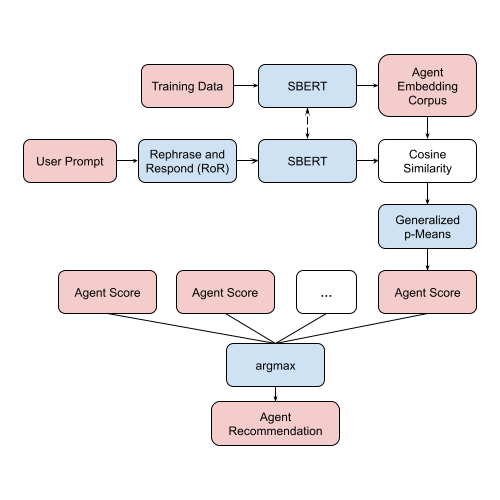

# AgentRec

AgentRec is a library for building small end-to-end models for agent
recommendation in multiagent systems. It contains functions for training,
testing, and evaluating robust agent recommendation systems. Unlike traditional
classification techniques, it is adaptive to new classes as the computation of
prior embeddings need not change. In the original paper, this library was able to
produce a model with a top-1 accuracy of 92.2% with a >=300 ms evaluation time.

## Implementation

To recommend an agent, it is important to find a knowledge representation that
allows us to compare and contrast the capabilities of LLM agents numerically.
Our research found that we can achieve this by encoding agent capabilities as
a corpus of many single-sentence user prompts which we know that a given LLM
agent can answer.

Afterwards, an unseen prompt is evaluated by comparing it to the many prompts
already labeled in the agent capabilities corpora. A score function which
produces a rank out of hundreds of comparisons then generates the top-k agent
recommendations.



## Usage

It is important to first install the dependencies. This repository was written
using Python 3.12. It is recommended to use a venv with the following commands:

```bash
python -m venv venv
source venv/bin/activate
pip install -r requirements.txt
```

A LLM is also necessary, which must produce the input and output of an OpenAI
formatted context. More details about implementing this are in the documentation.

A synthetic dataset can be generated using the `agentrec.datasets.PromptPool`
class. A list of agent names must be given, which can have optional
descriptions and examples tied to them. This dataset can then be saved through
serializing the `PromptPool`. A usage example is given in `generatedata.py`.
Note that a Huggingface API key must be inserted in `.env`.

Afterwards, one can finetune the model by using `finetune.py`. After finetuning,
it is possible to try out the agent recommendation system by using `test.py`.
Otherwise, pre-trained model weights are available in the releases.

## References

If you find this repository helpful, please feel free to cite our work.

```
@article{park2025agentrec,
  title={AgentRec: Agent Recommendation Using Sentence Embeddings Aligned to Human Feedback},
  author={Park, Joshua and Zhang, Yongfeng}
  year={2025}
}
```
